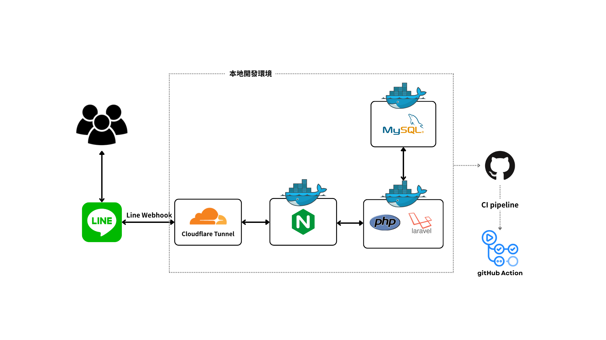

# LINE Bingo Game（Laravel+Docker+CI）

這是一個透過 **LINE Bot** 與使用者互動的賓果遊戲，使用**PHP** 搭配 **Laravel 框架** 建立遊戲邏輯，透過 **Docker Compose** 快速建置開發環境。並使用 **Cloudflare Tunnel**，在本地運行並支援 HTTPS Webhook。

## 目錄
- [架構圖](#架構圖)
- [賓果遊戲流程](#賓果遊戲流程)
- [主要技術](#主要技術)
- [開發與啟動方式](#開發與啟動方式)
- [賓果遊戲 Demo](#賓果遊戲-demo)

## 架構圖



## 賓果遊戲流程

### 1. 加入好友
使用者加入 LINE Bot 時會觸發 Webhook，後端建立使用者資料，並回傳歡迎訊息。

### [2. 建立賓果卡](#1-加入好友並建立賓果卡)
- 使用者可透過圖文選單選擇「新增賓果卡」
- 系統引導輸入 5x5 的賓果卡號碼
- 使用者確認後會建立卡片

### [3. 開始對獎](#2-開始對獎)
- 輸入「開始兌獎」進入開獎模式
- 使用者輸入開獎號碼
- 系統即時計算兌獎狀況，並回傳進度

## 主要技術

| 類別 | 工具 | 說明 |
|------|------|------|
| Backend | PHP 8.2, Laravel 10  | 核心邏輯 |
| Webhook | LINE Messaging API | 接收事件並互動 |
| Docker | Docker Compose | 開發環境建置 |
| Tunnel | Cloudflare Tunnel | 將 local Webhook 暴露為 HTTPS |
| Test | PHPUnit | 整合測試與單元測試 |
| CI | GitHub Action | 自動化測試流程 |
| Script | `local-deploy.sh` | 一鍵建置與啟動 Container |

## 開發與啟動方式

```bash
## 啟動本地開發環境
bash local-deploy.sh

## 或手動執行
docker compose up --build -d
docker-compose exec app php artisan migrate

## 開啟 cloudflared tunnel
# 前提：
# 1. 已開通 tunnel 
# 2. 已設定 LINE Webhook URL
cloudflared tunnel --config ~/.cloudflared/my-line-bot.yml run my-line-bot
```

## 賓果遊戲 Demo
### 1. 加入好友並建立賓果卡


### 2. 開始對獎
